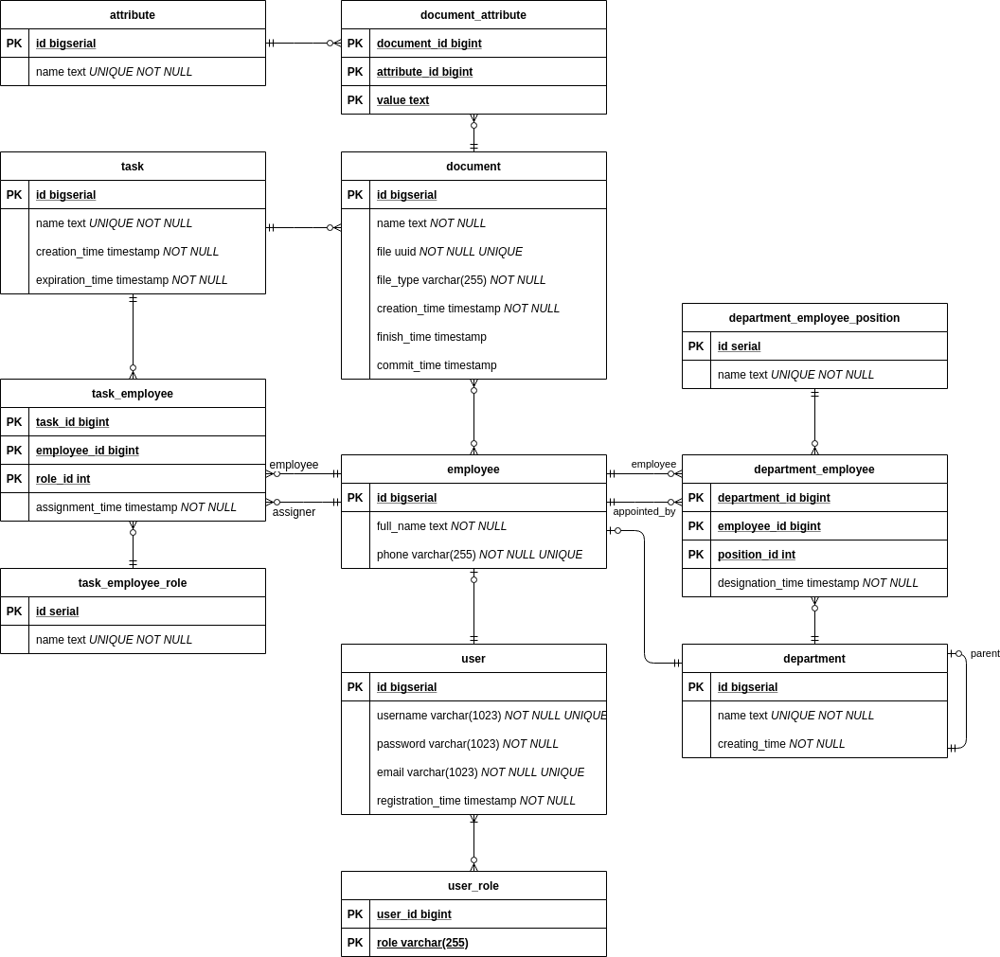

# Electronic Document Management Project

## Функциональные требования:
##### Кабинет пользователя должен включать в себя следующие функции:
* 1 Добавление атрибутов на лету, их редактирование и удаление
* 3 Локализация на сайте и в приложении
* 1 Справочник с пользовтелями и их контакты
* 1 Разбиение пользователей на отделы
* 3 Встроенный календарь
* 3 Интеграция с корпоративной почтовой системой (получение оповещений о новых документах и заданиях), MS Office
* 2 Вкладка с заданиями: текущие задания, срочные (подходщие к концу выполнения, можно просто выделить в текущих),
 просроченные (с истекшим сроком выполнения, можно просто пометить в вкладке текущих), документы возвращенные на доработку
* 1 Позволяет импортировать форматы: doc/pdf/docx/xlsx
* 1 Редактирование и скачивание документов/заданий/отчетов
* 2 Предпросмотр и индексация содержимого документов
* 2 Прямая и обратная связь Начальства (кто ставит задания) и работников
* 1 Отправка готового результата на проверку
* 2 Отправка готового результата на подпись/печать
* 2 Обеспечение отчетности и анализа по заданию/заданиям
* 1/3 История изменения документа (например в виде контроль версий)
* 2 История выполнения задания, процент готовности
* 2 Поиск по всему сайту и по отдельным его областям (например по зданиям или по документам)
* 1 Хранение и классификация документов
* 3 Возможность указания отдела вместо конкретных сотрудников
* 4 Возможность подписи цифровой подписью (Optional)
* 4 Свзяь внутри отдела (Optional)

##### Кабинет пользователя с дополнительными параметрами (начальства):
* 2 Комментирование и исправление ошибок (4 добавление звукозаписи для пояснения)
* 1 Добавление, редактирование и удаление задания (можно до и после создания задания)
* 1 Выбор исполнителя и исполнителей и/или выбор отвественного, который выберет исполнителей
* 1 Возможность указать куратора
* 2 Иерархия исполнителей и куратов (например в виде дерева)
* 2 Установка срока выполнения (Optional несколько сроков)

##### Админ:
* 2-3 Поддержка рабочего места администратора безопасности и необходимые средства оперативного контроля и воздействия
* 2-3 Возможность блокирования работы отдельных пользователей
* 2-3 Управление правами доступа к содержанию документов, метаданным, версиям
* 2-3 Возможность точечного управления правами доступа пользователей

## Нефункциональные требования:
* Java 8-11 (Liberica JDK)
* Spring boot, Spring Data, Spring Web, Spring Security
* СУБД PostgreSQL
* Gradle (?)
* Docker
* React

## Структура БД:

### Сущности

- Роль пользователя - одна из ролей пользователя системы
- Пользователь - пользователь системы, имеет имя, пароль, почту, время регистрации и набор ролей
- Сотрудник - сотрудник компании, имеет полное имя, номер телефона, пользователя и набор должностей
- Отдел - отдел предприятия, имеет название, время создания, родительский отдел и набор сотрудников
- Должность сотрудника отдела - должность сотрудника системы, имеет название
- _(ассоциация)_ Сотрудник отдела - должность сотрудника в отделе, имеет отдел, сотрудника,
должность, время назначения и назначившего сотрудника
- Задача - задача, поставленная сотрудникам предприятия, имеет название, время создания, дедлайн,
сотрудников и документы, созданные в рамках задачи
- Роль сотрудника задачи - роль, которую может иметь сотрудник в задаче, имеет название
- _(ассоциация)_ Сотрудник задачи - сотрудник, имеющий некоторую роль в задаче, имеет задачу,
сотрудника, роль, время назначения и назначившего сотрудника
- Атрибут - атрибут документа, имеет имя
- Документ - документ, имеет название, файл (UUID файла для поиска в ФС), MIME тип файла,
время создания, время завершения работы, время утверждения,
задачу (в рамках которой был создан документ), набор сотрудников-создателей, набор атрибутов
- _(ассоциация)_ Атрибут документа - атрибут документа, имеет документ, атрибут и значение атрибута

### Диаграмма

## REST API

- __POST__ _/login_ - аутентификация

- __POST__ _/users_ - создание пользователя
- __GET__ _/users/current_ - получение текущего пользователя
- __PATCH__ _/users/current_ - изменение текущего пользователя
- __GET__ _/users/{id}_ - получение пользователя по id
- __DELETE__ _/users/{id}_ - удаление пользователя по id
- __PATCH__ _/users/{id}_ - изменение пользователя по id
